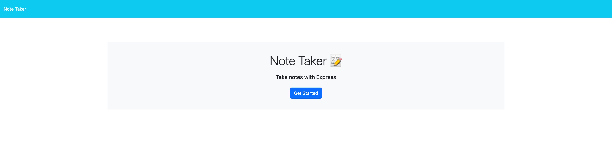
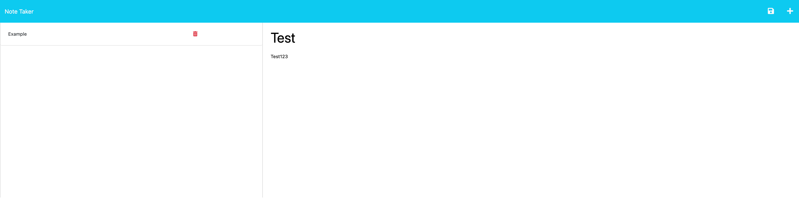

# { Note Taker }

📝

## Badges

 

 

## Table of Contents

- [Links](#links)
- [Description](#description)
- [Installation](#installation)
- [Usage](#usage)
- [Credits](#credits)
- [Resources](#resources)
- [License](#license)
- [Contribute](#contribute)
- [Questions](#questions)

## Links

- [GitHub README Deployment](https://davidmichaelmackey.github.io/note-taker/)
- [Heroku Deployment](https://evening-stream-81130.herokuapp.com/)

## Description

This is an application using Express.js and persistent storage that will allow users to take notes via a web interface. It uses POST, GET, and DELETE routes to add and retrieve notes from persistent storage. The application features a sleek interface and demonstrates Express.js and routing. This app was also deployed to Heroku using the Heroku CLI.

## Installation

Follow these commands to run the command-line application:

    npm i
    npm start
    or
    npm monitor

## Usage

## Credits

:bust_in_silhouette: [David Michael Mackey](https://www.notion.so/davidmichaelmackey/David-Mackey-a59ce61a996840d6a933e3b135673467?pvs=4) 
:email: [Email](mailto:davidmackey@hey.com) 
:octocat: [GitHub](https://github.com/davidmichaelmackey/) 
:briefcase: [Linkedin](https://linkedin.com/in/davidmichaelmackey/) 

## Resources
[Server setup and sendFile](https://expressjs.com/en/starter/hello-world.html) 
[API vs. HTML routes](https://expressjs.com/en/guide/routing.html#response-methods) 
[req.query and params](https://expressjs.com/en/guide/routing.html#route-parameters) 
[GET with Fetch API](https://developer.mozilla.org/en-US/docs/Web/API/Fetch_API/Using_Fetch) 
[Middleware for static assets](https://expressjs.com/en/starter/static-files.html) 
[Insomnia](https://docs.insomnia.rest/insomnia/get-started) 
[POST requests and routes](https://expressjs.com/en/starter/basic-routing.html) 
[Middleware for body parsing](https://expressjs.com/en/api.html#req.body) 
[POST with Fetch API](https://developer.mozilla.org/en-US/docs/Web/API/Fetch_API/Using_Fetch) 
[Data persistence using JSON](https://nodejs.org/api/fs.html#fs_file_system) 
[Modular routing](https://expressjs.com/en/guide/routing.html#express-router) 
[Custom middleware](https://expressjs.com/en/guide/writing-middleware.html) 
[Heroku deployment](https://devcenter.heroku.com/articles/getting-started-with-nodejs?singlepage=true) 

## Toolset

## License

  

## Contribute

[Contributor Covenant](https://www.contributor-covenant.org/)

## Questions

Have Questions?
 
Feel free send me an [email](mailto:davidmackey@hey.com) or reach out to me on [Linkedin](https://linkedin.com/in/davidmichaelmackey/).
